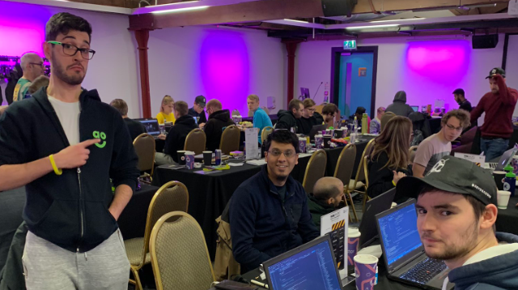

## An Introduction

Hack Manchester is a yearly 24 hour hackathon event. Well, except this year where the dates perfectly coincided with us turning the clocks back an hour, bidding farewell to our beloved British Summer Time, which obviously meant that we instead ended up with a unique 25 hour hackathon event this time round.

Anyways, each main event sponsor gets given the chance to define a challenge and then it is up to the participating teams made up of a maximum of four members to choose which of the challenges they want to hack together a solution for over the event. There are then obviously judges from each company who make the decision of which solution, they like the most.

This year, I and three friends who are also work colleagues decided to enter a team and given that we’re all within our early twenties, as you can probably guess this was our first opportunity to participate in a hack day of this sheer size and calibre.

Back on topic, this post is just going to discuss how the event went for us as well as just sprinkle some tips that could potentially help others prepare not just for future Hack Manchester events, but also any sort of similar Hackathon challenges. I think if you’ve never tackled anything like this before, it can certainly be quite daunting at first. So, if this blog post helps hold your hand and put your mind at rest about a few things, then it has certainly done its job!

## Challenges

Believe it or not, deciding which of the available challenges your team wants to tackle is a challenge within its own right. We researched challenges from previous years and found it a little bit difficult to fathom the hand that we had been dealt for 2018, but us software developers like a good mind-boggle, don’t we?

An example of a very strange challenge was one where challengers had to create something driven by user data to somehow tailor a terrible user experience back to customers. Whilst that is a good challenge in terms of the potential scope of possibilities and from a technical complexity standpoint, we struggled to motivate ourselves towards spending 24 hours hacking together an MVP of an idea with essentially no actual genuine delivered business case or value at the end of it.

The spread of number of teams who chose each challenge was shared by the organisers on Slack and it was clear that this year there was a significant imbalance which saw one challenge being heavily favoured over others by teams. You can also argue that awkward challenges like this also adds to the difficulty element all round, but unfortunately, we didn’t really buy in to that idea. Instead, we ended up hacking together a proof of concept for an idea we had come up with beforehand and pivoted it in line with one of the challenges, but without too much emphasis on trying to go out of our way to also satisfy the challenge as feedback on our proof of concept was more important to us than winning a few Crystal Maze tickets. So, I guess you’ll have to make of that what you will!

The challenge we chose was unsurprisingly the challenge that most other teams also decided to pursue which was courtesy of [ClockworkSMS](https://www.clockworksms.com). The challenge was to use their SMS API in the most bizarre way possible. Bizarre obviously being the key word here and the decisive factor in judging the entries.

## Our Idea

We spent plenty of time brainstorming together ideas for plenty of different challenges, but we ended up going with a simplified version of a side project idea I’d had lingering in my head for a while.

We were considering taking on another challenge – where the challenge was to use open source data to make train delays less painful and more fun for commuters - with the idea of a taxi pooling application for train commuters where we predicted whether delays were likely and if so, aim to bring together people going to the same place to hop in a taxi together, split the fair and get to their final destination quicker and essentially cheaper. In hindsight, we probably should’ve gone down this route to create something a little bit cooler, but I guess you live and learn!

To cut a long story short, the project idea we did pursue was really inspired through my own personal questioning of Groupon’s extortionate pricing strategy to provide marketing services for businesses. To give you a quick rundown, if you want to use Groupon as a business owner to offer customers 50% off a £100 product – where you’re willing to obviously take a hit to reach more customers through Groupon’s platform with the hope that they become recurring customers – Groupon take 50% of the £50 you are left with per sale. This essentially leaves you with a £25 gain on a £100 sale which in many cases just isn’t worth it for some businesses depending on their overheads. Unfortunately, many business owners just don’t know any better and are desperate to generate any kind of revenue, even if operating at a loss during desperate times.

So, what if there was a similar service where you could instantaneously somehow specify something such as “we are four people, looking for a restaurant at 8pm tonight” either via SMS or through an application or whatever and then have a selection of automated offers from within your local area sent straight to you to choose from? You could then perhaps even integrate accepting or rejecting these offers in to some tinder-like interface for acceptance where they are then saved in your wallet on your phone to claim later that day before they expire.

This wouldn’t be limited to just the food industry, obviously. But for a small monthly fee, businesses would be happy to be added to their local pool of businesses reaching out to relevant customers as an incentive to bring new people through the door every now and then. Think of it as a digitally targeted flyer service – but instead of spending hundreds printing thousands of flyers that are distributed through uninterested letterboxes and go straight in to the bin, you target those who are already warm leads.

Restaurants could even have control to turn their availability on during certain weekdays for example when they aren’t quite as busy as they would like to be. This means restaurants can offer larger discounts that users believe are unique to them which still undercuts Groupon’s model and due to the larger discounts, users will feel that they are essentially getting a better unique deal. Restaurants in this case would also have an in-depth statistical overview on how many people within the local area have been offered their offer as an example and how many have saved/claimed it. Note that it doesn’t even have to just be limited to restaurants either.

It’s a simple idea and a spin of what already exists both digitally and non-digitally, but it’s a case where the user experience could make a difference relative to competitor products and obviously it is still an idea that needs a little more development to make it more unique, but it was something we all bought in to. It would also be a significantly cheaper alternative to Groupon and while it would probably result in less customers gained overall, the return on investment would probably be tastier (no pun intended) for them. So, this is really where the motivation for our hack day spin-off inspiration came to mind.

Anyways, obviously implementing a proof of concept or minimum viable product of this idea as an SMS based prototype limited to restaurants in under 24 hours was potentially possible, the problem was that we knew it just wasn’t quite bizarre enough. This is where we came up with “SomethingGood”. For times when you just can’t decide what food you want to order in, so you text “FEED ME 4 people £30” to a service number and based on your previously configured dietary requirements and other preferences you may or may not have previously set within an accompanying web application, your randomised order based on the number of diners and budget is generated and sent to a local establishment to fulfil. You then stop wasting time arguing and trying to decide what you want to order in and instead spend more time anticipating the surprising discounted meal you’re getting and hopefully as a result end up enjoying your grub! The establishment have the freedom to accept or reject orders too and so on. Probably more random than bizarre, but a challenge nonetheless.

While it might be tempting to compare it to “Just Eat via SMS”, the underlying business model and customer usage mindset that brings them to use this kind of service over alternatives, we believe would be different to Jus tEat. For example, as soon as users realise the trade off for going for a randomised order is a very good discount off the overall price which resultantly means more food for less money – as well as save time bickering about what to eat - users are suddenly willing to take the gamble. Restaurants are often happy to offer larger discounts even if it means smaller profit margins during less busy times such as during the week, but they know they’ll have a new long-term recurring customer if their food is tasty. If they are spending significantly less to be within this randomised pool, they will also most likely still be able to make a profit despite offering a large discount unlike the Groupon model described earlier in this post.

Overall, was our idea bizarre enough for the challenge? Probably not. Some of the judges thought so, others not as much. Regardless, it was the best idea with a genuine business case and model that we could come up with in the short time that we had. We not only knew that we’d have fun developing the idea, but because we strangely felt as if it was something we would use ourselves, we had the motivation to build it whilst also having a laugh in doing so – which is what it’s all about in the end, right? In the end, it received plenty of social proof from judges at the event, other developers at the event and work colleagues. We were quite overwhelmed by the amount of people who just happily admitted on their own that they would want to use a service such as this… as bizarre as it sounds (see what I did there?).

## My Two Cents

Those who know me well, know that I’m a huge advocate of the idea of learning from mistakes and I’d therefore like to finish off this post by covering some points based on what I’ve personally learned over the past weekend that you might find useful if you’re looking to attend your first hack. Obviously though, this is all relative to my own experience, so take everything I might suggest with a pinch of salt.

### Idea over complexity
- It’s no lie that as software developers or engineers or craftsmen or whatever funky names different companies call us nowadays, plenty of us are very good when it comes to overcomplicating or overengineering things. We ended up implementing long winded elements that were fundamental to our idea such as the correct choosing of order items based on the user’s budget, their set user preferences & so on. The issue with this is that with complexity, comes a larger time to implement & unless you are trading time for getting a step closer to satisfying your chosen challenge (in this case, adding all this fluff wasn’t making our idea more bizarre, in fact it was doing the opposite) then don’t do it or just “hack” it in with fake data and spend more time either sleeping, or doing something more important.
- For example, when the judges came around and asked us to demo our
	   final product, they didn’t question whether the randomised food
	   selection was correctly functional which made us question whether we
	   should’ve just had a few different hard coded possibilities in our
	   solution and just respond with one at random. Doing so would have
	   saved a lot of development time that we put in to hacking together
	   the real thing.
- The simpler you can keep your project whilst still strongly meeting
	   the criteria of your challenge, the better. Ask yourself, will losing
	   sleep over adding this extra feature really make a difference to the
	   judges? Many of the previous year winners aren’t very complex
	   applications from a development point of view, they just absolutely
	   nail the challenge with their unique idea.
- If your idea to meet the criteria of your challenge is amazing and
	   you bump in to a few hiccups during the development process which
	   means your demo suffers, you will most likely still be in better
	   stead than someone else who has a lacklustre idea or an idea that
	   doesn’t quite suit the challenge but has developed it perfectly. This
	   isn’t a University assessment.
	   
### Favour ideas where you can give the judges a front-end
- We knew going in to the event that we would suffer because of a lack
	   of a real front-end to our idea as it was solely SMS based. A lot of the time, particularly with
	   non-technical judges, attractive presentation and a nice interface
	   with a logo that is easy on the eye can be a deal breaker and make
	   the difference – even if you’re just using faked data or faked
	   functionality. Use your mobile device camera as part of your idea,
	   scan QR codes, have maps or whatever funky stuff you can think of
	   which will probably be simple to put together but will wow the
	   judges.
	   
### Is your team well balanced?
- Following on from the last point, obviously this is relative to the challenge you are taking on and what you are developing, however the better you can delegate everybody’s time throughout the hack day, the more efficient the process will be.
- Are you building a mobile application? If so, do you need at least one expert in this field within the team? Do you need a complex front-end? If so, do you need at least one front-end developer who can crack on with it whilst the rest focus on the back-end? If you’re in it to win it, you should aim to build a team with people of different skillsets.
- In our case, we had a team of three developers with different skillsets alongside a business analyst. I myself am pretty full-stack nowadays, another member was an android expert and the other was a back-end C# whizz – shout out to the world of web forms. Could we have chosen a different challenge or pursued a different idea that would have better utilised our abilities?
	   
### Consider taking technical risks… we think?
- We were made to believe beforehand that the judges would not judge on
	   technology decisions, however depending on the judges for the company
	   whom you are completing a challenge for, there very well may be
	   technical judges in the fold.	   
- We found that some technical judges did ask questions about why we
	   	   chose specific technologies to build our hack with and based on
	   	   comments from some, they came across as dissatisfied with the usual
	   	   standard responses. I found this strange and disappointing as while
	   	   it is correct to probably award a small number of bonus points to
	   	   teams who have pushed themselves out of their comfort zones by taking
	   	   a risk, it seems the old idea that one shouldn’t use hackathons as an
	   	   opportunity to learn something new is no longer something that is
	   	   agreed upon, which is strange. I know we weren’t the only team that
	   	   felt confused about this, but maybe we were just unfortunate this
	   	   time round.
- For example, while we could’ve quite easily pivoted away from a C#
	   	   .NET API hosted in Azure, unless we did something mental like try and
	   	   use the SMS API in something such as R or MATLAB, I’m not actually
	   	   quite sure what wow factor would be added relative to the challenge
	   	   goals? Isn’t it globally accepted that hackathons aren’t the right
	   	   time to learn new things? Strange one.
- Another example is the fact that whilst our team was made up of
	   	   different technical backgrounds, we felt it was best for us to find
	   	   common ground in the technology we were all using as that way we
	   	   could better support each other. Makes sense, right?

### More questions to ask yourselves
- Do you really need to persist any data? If not, don’t waste any time
	   with it.	   
- Do you really need to deploy? If not, just run your project locally.
- Are you in it to have fun or to win? If you’re in it to have fun like we were, have fun. We had a judge telling us to try and pivot and try to make our idea more bizarre, but we didn’t really care as we were focused on our goal! (Note: These were all the same judges who also admitted they not only liked our idea but would most likely also use the idea if it existed, so that was fine with us!) We also used it as a great opportunity to meet and greet other fellow developers in the area, so don’t forget to network! 
		   
Oh, we also had some ribs and steak from “Rump n’ Ribs” next door to the venue. They were amazing!		   

In conclusion, those are some of my tips and takeaways from my weekend at my first ever Hack Manchester! I most likely plan on participating again in the future if there are any challenges that do genuinely capture my interest or if I can offer something technically to a fellow team at work that might be attending future ones.

If you’ve never been before, please do go. The guys who run it are awesome and it’s also a fantastic way to really push yourself and learn loads in a short period of time not just from what you’re doing but also from a lot of the people around you!

The software/tech scene in the North West and Manchester is at an all-time high. Be proud of events like this and play a part in helping it grow!

Peace ✌